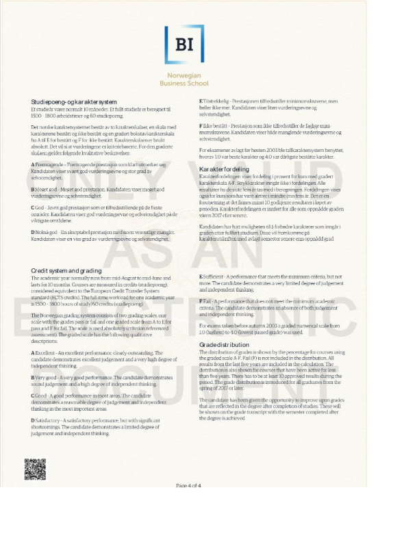

    
  

  <!-- GITHUB -->
<a href=">https://github.com/Borgerod">
   &nbsp;&nbsp;&nbsp;&nbsp;
</a>
<a href="https://discordapp.com/users/3934"  >
  &nbsp;&nbsp;&nbsp;&nbsp;
</a>
<a href="https://www.linkedin.com/in/aleksander-borger%C3%B8d-373a1a140/">
   &nbsp;&nbsp;&nbsp;&nbsp;
</a>
<a  href="https://www.facebook.com/aleksander.borgerod"  >
   &nbsp;&nbsp;&nbsp;&nbsp;
</a>
<a href="https://www.upwork.com/freelancers/~014d3a39c0b1b7b921">
   &nbsp;&nbsp;&nbsp;&nbsp;
</a>
<a href="mailto:borgerod@hotmail.com" >
   &nbsp;&nbsp;&nbsp;&nbsp;
</a>
 
 

# About me 
### Hello there, I'm Aleksander.

  

    <!-- ACTIVITY GRAPH -->
    I'm a software developer based in Bergen, Norway. Currently working as a freelancer, taking  jobs from both individuals and businesses. 
    With a great passion for learning and honing my skills, I never say no to a challange. Apart from my development carreer I have background in finance from BI business school, and have years of experience as an artist which I think goes along well with UI design.  Software development for me is a playground for crativity and problem solving, which is an arena I thrive in. I live and breath coding, and most of my day is spent infront of the keyboard creating obsessvly. Honestly, I think coding is genuinly fun, and I could spend days typing away without even noticing. If anything, I have to force myself to do other things.
    In a nutshell I would describe myself as resilient, solution driven and not to mention stubborn. If i don't know how to solve something, I will find out, or I will bash my head into the problem until it's fixed. 
         In regards to my expereince, I've found that I'm quite good at data extraction, where I've had tons of practice, as you might can tell from my repo.
    Most of my experence comes from Python, then Dart, Postgres. But in the near future I plan to expand my knowledge and start leaning another language, such as Jave, Rust or Goland. My upcomming goals are; Cloud integration, automatization and dive further down into data science. 
    Don't hesitate to make contact if you have any questions or ideas for future projects, I'd love to hear them.  Take care and have fun creeping through my profile! 
  

 
 
<!-- DIVIDER -->

<!-- PROFILE STATS 1: -->
<!--  height=200 max-width: min-content -->
<!-- ### My Activity -->

      &nbsp;&nbsp;&nbsp;&nbsp;&nbsp;&nbsp;
      

 

  &nbsp;&nbsp;&nbsp;&nbsp;&nbsp;&nbsp;
   

 

## Top projects

<!-- REPO'S: -->

  

  <a href="https://github.com/Borgerod/BarniBus">
    &nbsp;&nbsp;&nbsp;
  </a>
  

  <a href="https://github.com/Borgerod/Telegram_surveillance">
    &nbsp;&nbsp;&nbsp;
  </a>
  
  

<!-- --- -->

<!-- # Miscs -->

<!-- About Education  -->
## Education
<!--    -->

The School 

  BI Norwegian Business School, founded in 1943, is the largest business school in Norway and the second largest in all of Europe. The school is an independent, not-for-profit foundation and the main provider of research based knowledge on business and management disciplines in Norway. <a href="https://www.bi.edu/about-bi/"> &emsp; Read more. </a>
   

 The Degree

  During a three-year programme, the students learn about management principles and practices, market influences, operations, finance, communication, and more. Because of this broad knowledge, they are able to analyse complex business problems from different perspectives, and easily cross different boundaries that may exist within and between organisations.<a href="https://www.bi.edu/programmes-and-individual-courses/bachelor-programmes/business-administration/?_ga=2.234882433.1428810685.1663844919-999560012.1663061493&_gac=1.124785016.1663844919.Cj0KCQjwj7CZBhDHARIsAPPWv3fnPSi5MZKxDILr882sr-8W3nlR6RDp1UhAD5TqfGbF1ibW1Hm0GGUaArWWEALw_wcB&_gl=1*1wb6rzy*_ga*OTk5NTYwMDEyLjE2NjMwNjE0OTM.*_ga_SY3KTJF2RZ*MTY2Mzg0NDkxOS4yLjAuMTY2Mzg0NDkxOS4wLjAuMA.."> &emsp; Read more </a>   
&emsp; • &emsp; **Operations** -  Optimization of businesses practices. 
&emsp; • &emsp; **Finance** - Underatand the financing of businesses , and judge the profitability of investments.  
&emsp; • &emsp; **Accounting** -  Systematically understand the financial activity of a business.  
&emsp; • &emsp; **Marketing** -  Basic concepts of marketing, and understand how to attract and keep customers  

 Diploma

 

## Literature
<!-- Literature  -->

 Financial

&emsp; • &emsp; Graham, B., Dodd, L. D. (1934 & 2008). *Security Analysis.* (6th ed.). New York: The McGraw-Hill Companies, Inc.  
&emsp; • &emsp;  Corrigan, J. R. (2021). *Understanding Economics: Game Theory - The Great Courses.* Virginia: The Great Courses.     

 Software Development

&emsp; • &emsp; Robert Cecil Martin, R. C., Wampler, D. (2008). *Clean Code: A Handbook of Agile Software Craftsmanship* London: Pearson   
&emsp; • &emsp; Martin, K (2020). *Cryptography: The Key To Digital Security, How It Works, And Why It Matters*. New York: W. W. Norton & Company.  
&emsp; • &emsp; Smith, J. (2021). *Algorithms and Data Sthuctures.* Jeffery Smith   

 Psychology

&emsp; • &emsp;  Kahneman, D. (2011). *Thinking, fast and slow.* New York: Farrar, Straus and Giroux.   
&emsp; • &emsp;  Corrigan, J. R. (2021). *Understanding Economics: Game Theory - The Great Courses.* Virginia: The Great Courses.    

 

# 
<!-- PROFILE COUNTER: -->
 
  

    <a>
      Profile visits: &nbsp;&nbsp; 
    </a>
  

 
<!-- 
 -->
