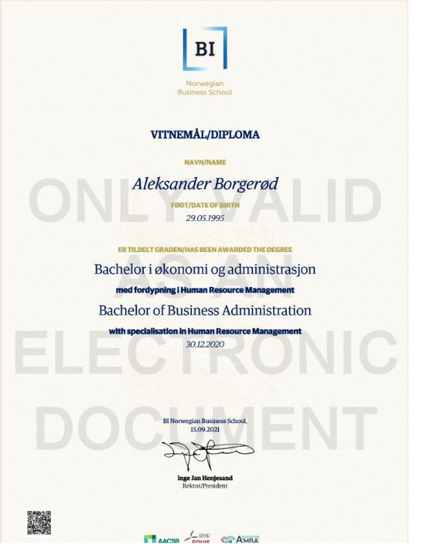
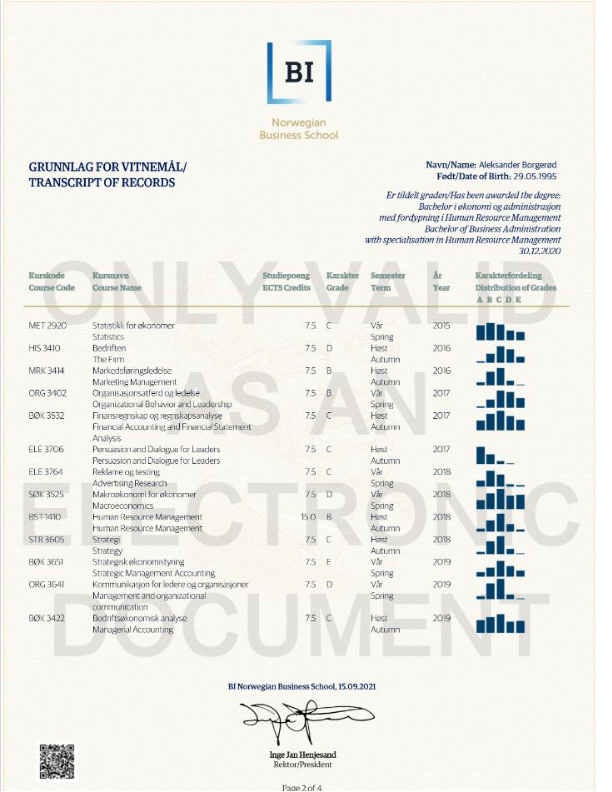
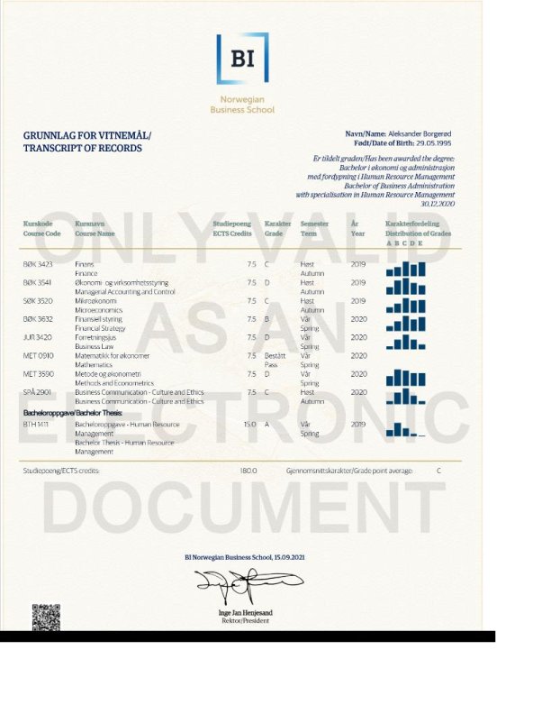
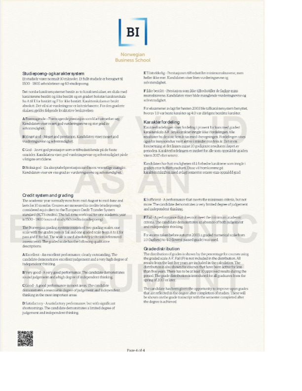

<table style="width:100%">                     
    <th> About Education</th>     
  <tr>
    <td valign="top">
      
    The School 
     BI Norwegian Business School, founded in 1943, is the largest business school in Norway and the second largest in all of Europe. The school is an independent, not-for-profit foundation and the main provider of research based knowledge on business and management disciplines in Norway. <a href="https://www.bi.edu/about-bi/"> &emsp; Read more. </a>
       
     The Degree
     During a three-year programme, the students learn about management principles and practices, market influences, operations, finance, communication, and more. Because of this broad knowledge, they are able to analyse complex business problems from different perspectives, and easily cross different boundaries that may exist within and between organisations.<a href="https://www.bi.edu/programmes-and-individual-courses/bachelor-programmes/business-administration/?_ga=2.234882433.1428810685.1663844919-999560012.1663061493&_gac=1.124785016.1663844919.Cj0KCQjwj7CZBhDHARIsAPPWv3fnPSi5MZKxDILr882sr-8W3nlR6RDp1UhAD5TqfGbF1ibW1Hm0GGUaArWWEALw_wcB&_gl=1*1wb6rzy*_ga*OTk5NTYwMDEyLjE2NjMwNjE0OTM.*_ga_SY3KTJF2RZ*MTY2Mzg0NDkxOS4yLjAuMTY2Mzg0NDkxOS4wLjAuMA.."> &emsp; Read more </a>   

&emsp; • &emsp; **Operations** -  Optimization of businesses practices. 
&emsp; • &emsp; **Finance** - Underatand the financing of businesses , and judge the profitability of investments.  
&emsp; • &emsp; **Accounting** -  Systematically understand the financial activity of a business.  
&emsp; • &emsp; **Marketing** -  Basic concepts of marketing, and understand how to attract and keep customers  
 
</td>
  </tr>
</table>

About Education 
  
The School 
  BI Norwegian Business School, founded in 1943, is the largest business school in Norway and the second largest in all of Europe. The school is an independent, not-for-profit foundation and the main provider of research based knowledge on business and management disciplines in Norway. <a href="https://www.bi.edu/about-bi/"> &emsp; Read more. </a>
   
 The Degree
  During a three-year programme, the students learn about management principles and practices, market influences, operations, finance, communication, and more. Because of this broad knowledge, they are able to analyse complex business problems from different perspectives, and easily cross different boundaries that may exist within and between organisations.<a href="https://www.bi.edu/programmes-and-individual-courses/bachelor-programmes/business-administration/?_ga=2.234882433.1428810685.1663844919-999560012.1663061493&_gac=1.124785016.1663844919.Cj0KCQjwj7CZBhDHARIsAPPWv3fnPSi5MZKxDILr882sr-8W3nlR6RDp1UhAD5TqfGbF1ibW1Hm0GGUaArWWEALw_wcB&_gl=1*1wb6rzy*_ga*OTk5NTYwMDEyLjE2NjMwNjE0OTM.*_ga_SY3KTJF2RZ*MTY2Mzg0NDkxOS4yLjAuMTY2Mzg0NDkxOS4wLjAuMA.."> &emsp; Read more </a>   
&emsp; • &emsp; **Operations** -  Optimization of businesses practices. 
&emsp; • &emsp; **Finance** - Underatand the financing of businesses , and judge the profitability of investments.  
&emsp; • &emsp; **Accounting** -  Systematically understand the financial activity of a business.  
&emsp; • &emsp; **Marketing** -  Basic concepts of marketing, and understand how to attract and keep customers  

 Diploma

 

Literature 

 Financial

&emsp; • &emsp; Graham, B., Dodd, L. D. (1934 & 2008). *Security Analysis.* (6th ed.). New York: The McGraw-Hill Companies, Inc.  
&emsp; • &emsp;  Corrigan, J. R. (2021). *Understanding Economics: Game Theory - The Great Courses.* Virginia: The Great Courses.     

 Software Development

&emsp; • &emsp; Robert Cecil Martin, R. C., Wampler, D. (2008). *Clean Code: A Handbook of Agile Software Craftsmanship* London: Pearson   
&emsp; • &emsp; Martin, K (2020). *Cryptography: The Key To Digital Security, How It Works, And Why It Matters*. New York: W. W. Norton & Company.  
&emsp; • &emsp; Smith, J. (2021). *Algorithms and Data Sthuctures.* Jeffery Smith   

 Psychology

&emsp; • &emsp;  Kahneman, D. (2011). *Thinking, fast and slow.* New York: Farrar, Straus and Giroux.   
&emsp; • &emsp;  Corrigan, J. R. (2021). *Understanding Economics: Game Theory - The Great Courses.* Virginia: The Great Courses.    

<!-- &emsp; • &emsp; Robert Cecil. (2008). *Clean Code: A Handbook of Agile Software Craftsmanship 1st Edition.*   -->
<!-- &emsp; • &emsp; Keith Martin (2020). *CryptoGraphy.*  
&emsp; • &emsp; Jeffery Smith. (2021). *Algorithms and Data Sthuctures.*    -->

<!-- 
Literature 

 Financial

&emsp; • &emsp; Robert Cecil. (2008). *Clean Code: A Handbook of Agile Software Craftsmanship 1st Edition.*  
&emsp; • &emsp; Jay R Corrigan. (2021). *Understanding Economics: Game Theory - The Great Courses.*  
&emsp; • &emsp; Keith Martin (2020). *CryptoGraphy.*  
&emsp; • &emsp; Daniel Kahneman. (2011). *Thinking, fast and slow.*  
&emsp; • &emsp; Jeffery Smith. (2021). *Algorithms and Data Sthuctures.*   

 -->

<!-- <table style="width:100%">                     
    <th> Literature </th>   
    <th> Diploma</th>    
  <tr>
    <td valign="top"> 
      

&emsp; • &emsp; Robert Cecil. (2008). *Clean Code: A Handbook of Agile Software Craftsmanship 1st Edition.*  
&emsp; • &emsp; Jay R Corrigan. (2021). *Understanding Economics: Game Theory - The Great Courses.*  
&emsp; • &emsp; Keith Martin (2020). *CryptoGraphy.*  
&emsp; • &emsp; Daniel Kahneman. (2011). *Thinking, fast and slow.*  
&emsp; • &emsp; Jeffery Smith. (2021). *Algorithms and Data Sthuctures.*   
     

    </td>
    <td valign="top">
      

      
      
      
      
      

    </td>
  </tr>
</table> -->

                     
                     
                     

Robert Cecil Martin, R. C., Wampler, D.

Robert Cecil. (2008). *Clean Code: A Handbook of Agile Software Craftsmanship 1st Edition.*
2008

London: Pearson 

Graham, B., Dodd, L. D. (1934 & 2008). *Security Analysis.* (6th ed.). New York: The McGraw-Hill Companies, Inc.

Martin, K (2020). *Cryptography: The Key To Digital Security, How It Works, And Why It Matters*. New York: W. W. Norton & Company.

Kahneman, D. (2011). *Thinking, fast and slow.* New York: Farrar, Straus and Giroux.

Corrigan, J. R. (2021). *Understanding Economics: Game Theory - The Great Courses.* Virginia: The Great Courses. 

<table style="width:100%">                     
    <th> Diploma</th>     
    <th> About Education</th>     
  <tr>
    <td valign="top">
      

      
      
      
      
      

    </td>
    <!--  -->
    <td valign="top">
        <a href="https://www.bi.edu/about-bi/"> - BI Business school</a>
          
        <a href="https://www.bi.edu/programmes-and-individual-courses/bachelor-programmes/business-administration/?_ga=2.234882433.1428810685.1663844919-999560012.1663061493&_gac=1.124785016.1663844919.Cj0KCQjwj7CZBhDHARIsAPPWv3fnPSi5MZKxDILr882sr-8W3nlR6RDp1UhAD5TqfGbF1ibW1Hm0GGUaArWWEALw_wcB&_gl=1*1wb6rzy*_ga*OTk5NTYwMDEyLjE2NjMwNjE0OTM.*_ga_SY3KTJF2RZ*MTY2Mzg0NDkxOS4yLjAuMTY2Mzg0NDkxOS4wLjAuMA..">- My Degree</a>
    </td>
  </tr>
</table>

<table style="width:100%">                     
    <th> Literature </th>     
  <tr>
    <td valign="top"> 
      

&emsp; • &emsp; Robert Cecil. (2008). *Clean Code: A Handbook of Agile Software Craftsmanship 1st Edition.* 
&emsp; • &emsp; Jay R Corrigan. (2021). *Understanding Economics: Game Theory - The Great Courses.* 
&emsp; • &emsp; Keith Martin (2020). *CryptoGraphy.* 
&emsp; • &emsp; Daniel Kahneman. (2011). *Thinking, fast and slow.* 
&emsp; • &emsp; Jeffery Smith. (2021). *Algorithms and Data Sthuctures.*  
     

    </td>
  </tr>
</table>

<table style="width:100%">                     
    <th> Diploma</th>     
    <th> About Education</th>     
  <tr>
    <td valign="top">
      

      
      
      
      
      

    </td>
    <!--  -->
    <td valign="top">
    The School 
      
     BI Norwegian Business School, founded in 1943, is the largest business school in Norway and the second largest in all of Europe. The school is an independent, not-for-profit foundation and the main provider of research based knowledge on business and management disciplines in Norway. <a href="https://www.bi.edu/about-bi/"> &emsp; Read more. </a>
       
    The Degree
      During a three-year programme, the students learn about management principles and practices, market influences, operations, finance, communication, and more. Because of this broad knowledge, they are able to analyse complex business problems from different perspectives, and easily cross different boundaries that may exist within and between organisations.<a href="https://www.bi.edu/programmes-and-individual-courses/bachelor-programmes/business-administration/?_ga=2.234882433.1428810685.1663844919-999560012.1663061493&_gac=1.124785016.1663844919.Cj0KCQjwj7CZBhDHARIsAPPWv3fnPSi5MZKxDILr882sr-8W3nlR6RDp1UhAD5TqfGbF1ibW1Hm0GGUaArWWEALw_wcB&_gl=1*1wb6rzy*_ga*OTk5NTYwMDEyLjE2NjMwNjE0OTM.*_ga_SY3KTJF2RZ*MTY2Mzg0NDkxOS4yLjAuMTY2Mzg0NDkxOS4wLjAuMA.."> &emsp; Read more </a>   

&emsp; • &emsp; **Operations** -  Optimization of businesses practices.
&emsp; • &emsp; **Finance** - Underatand the financing of businesses , and judge the profitability of investments. 
&emsp; • &emsp; **Accounting** -  Systematically understand the financial activity of a business. 
&emsp; • &emsp; **Marketing** -  Basic concepts of marketing, and understand how to attract and keep customers 
 
</td>
  </tr>
</table>

<table style="width:100%">                     
    <th> Literature </th>     
  <tr>
    <td valign="top"> 
      

&emsp; • &emsp; Robert Cecil. (2008). *Clean Code: A Handbook of Agile Software Craftsmanship 1st Edition.* 
&emsp; • &emsp; Jay R Corrigan. (2021). *Understanding Economics: Game Theory - The Great Courses.* 
&emsp; • &emsp; Keith Martin (2020). *CryptoGraphy.* 
&emsp; • &emsp; Daniel Kahneman. (2011). *Thinking, fast and slow.* 
&emsp; • &emsp; Jeffery Smith. (2021). *Algorithms and Data Sthuctures.*  
     

    </td>
  </tr>
</table>

<!-- 

<td valign="top">
    <a href="https://www.bi.edu/about-bi/"> - BI Business school</a>
      
    <a href="https://www.bi.edu/programmes-and-individual-courses/bachelor-programmes/business-administration/?_ga=2.234882433.1428810685.1663844919-999560012.1663061493&_gac=1.124785016.1663844919.Cj0KCQjwj7CZBhDHARIsAPPWv3fnPSi5MZKxDILr882sr-8W3nlR6RDp1UhAD5TqfGbF1ibW1Hm0GGUaArWWEALw_wcB&_gl=1*1wb6rzy*_ga*OTk5NTYwMDEyLjE2NjMwNjE0OTM.*_ga_SY3KTJF2RZ*MTY2Mzg0NDkxOS4yLjAuMTY2Mzg0NDkxOS4wLjAuMA..">- My Degree</a>
</td> -->

<!-- <td valign="top">
    <th> The School </th>
      
     BI Norwegian Business School, founded in 1943, is the largest business school in Norway and the second largest in all of Europe. The school is an independent, not-for-profit foundation and the main provider of research based knowledge on business and management disciplines in Norway. <a href="https://www.bi.edu/about-bi/"> &emsp; Read more. </a>
       
    <th> The Degree </th>
      During a three-year programme, the students learn about management principles and practices, market influences, operations, finance, communication, and more. Because of this broad knowledge, they are able to analyse complex business problems from different perspectives, and easily cross different boundaries that may exist within and between organisations.<a href="https://www.bi.edu/programmes-and-individual-courses/bachelor-programmes/business-administration/?_ga=2.234882433.1428810685.1663844919-999560012.1663061493&_gac=1.124785016.1663844919.Cj0KCQjwj7CZBhDHARIsAPPWv3fnPSi5MZKxDILr882sr-8W3nlR6RDp1UhAD5TqfGbF1ibW1Hm0GGUaArWWEALw_wcB&_gl=1*1wb6rzy*_ga*OTk5NTYwMDEyLjE2NjMwNjE0OTM.*_ga_SY3KTJF2RZ*MTY2Mzg0NDkxOS4yLjAuMTY2Mzg0NDkxOS4wLjAuMA.."> &emsp; Read more </a>   

&emsp; • &emsp; **Operations** -  Optimization of businesses practices.
&emsp; • &emsp; **Finance** - Underatand the financing of businesses , and judge the profitability of investments. 
&emsp; • &emsp; **Accounting** -  Systematically understand the financial activity of a business. 
&emsp; • &emsp; **Marketing** -  Basic concepts of marketing, and understand how to attract and keep customers 
 
</td> -->

<!-- # MULTIPLE ROW TABLE
<table>
<th>
    literature:
</th>
    <tr>
      <td>
        book1
      </td>
    </tr>
    <tr>
      <td>
        book2
      </td>
    </tr>
    <tr>
      <td>
        book3
      </td>
    </tr>
    <tr>
      <td>
        book4
      </td>
    </tr>
</table> -->

<!-- DROP DOWN TABLE  -->
<!-- 

  

    <b style="font-size:14px">
      Literature
    </b>
  

<table>                     
    <th> Column 1 </th>     
        <tr><td> book1 </td></tr>
        <tr><td> book2 </td></tr>
        <tr><td> book3 </td></tr>
        <tr><td> book4 </td></tr>
</table>       

 -->

<!-- <table>                     
    <th> Column 1 </th>     
    <th> Column 2 </th>     
    <th> Column 3 </th>     
        <tr>                
            <td> book1 </td>
            <td> book2 </td>
            <td> book3 </td>
        </tr>               
        <tr>                
            <td> book1 </td>
            <td> book2 </td>
            <td> book3 </td>
        </tr>               
</table>   -->

<!-- 
<table>
    <th>
        Column 1
    </th>
    <th>
        Column 2
    </th>
    <th>
        Column 3
    </th>
  <tr>
    <td>
      book1
    </td>
    <td>
      book1
    </td>
    <td>
      book1
    </td>
  </tr>
</table>
 -->
